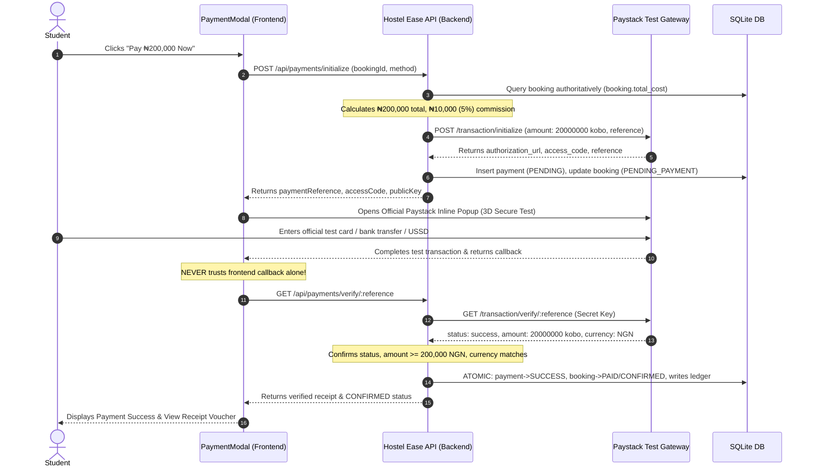

# Hostel Ease — Paystack Test Mode Integration Guide (Step 1)

## 1. Overview
This document describes the implementation of **Paystack Test Mode** in Hostel Ease for LAUTECH student accommodation checkout. 
The system connects the existing checkout UI directly to the official Paystack API, enforcing strict server-side price integrity, authoritative payment verification, double-entry financial ledger recording, and idempotent webhook handling.

---

## 2. Environment Variables & Credentials

Paystack credentials are configured using environment variables in `.env` (derived from `.env.example`).
**Security Rule**: Secret keys are **strictly server-side** and must never be exposed to the frontend, Git repository, or client bundles.

| Variable Name | Context | Description | Example / Format |
|---|---|---|---|
| `PAYSTACK_SECRET_KEY` | Server-side only | Used by Express backend to initialize and verify transactions | `sk_test_...` |
| `PAYSTACK_PUBLIC_KEY` | Server-side / Client | Public key used for frontend checkout initialization | `pk_test_...` |
| `PAYSTACK_WEBHOOK_SECRET` | Server-side only | HMAC SHA512 secret for validating incoming Paystack webhooks | Shared webhook secret |
| `VITE_PAYSTACK_PUBLIC_KEY` | Client-side (Vite) | Frontend public key for Paystack Inline popup | `pk_test_...` |
| `PAYMENT_PROVIDER` | Server & Client | Default gateway adapter | `PAYSTACK` |

---

## 3. Business Model: 5% Booking Commission Architecture

- **Accommodation Total (e.g. ₦200,000)**: The student pays the **single total accommodation price**.
- **No Separate Payments**: Students do **not** calculate 5%, make separate transactions, or send manual fees.
- **5% Commission**:
  - Accommodation Price = ₦200,000
  - Hostel Ease Platform Commission (5%) = ₦10,000
  - Landlord Net Earning = ₦190,000
- **Phase 1 Scope**: In this phase, the payment is verified in test mode and recorded into the double-entry `financial_ledger`. Live automated split settlement / subaccounts will be activated in **Step 2**.

---

## 4. Payment Flow Lifecycle

---

## 5. Security & Duplicate-Payment Protection

1. **Zero Trust on Frontend Prices**:
   - The payment amount is **never accepted from the client request body**.
   - The backend queries `bookings.total_cost` directly from the database and multiplies by 100 to obtain kobo.
2. **Authoritative Verification Only**:
   - A booking is **never marked as paid** by simply clicking Pay or receiving a frontend callback.
   - The server makes an authenticated call to `https://api.paystack.co/transaction/verify/:reference` with `Bearer ${PAYSTACK_SECRET_KEY}`.
   - The verified amount and currency (`NGN`) must strictly match the database record.
3. **Prevention of Double Payments & Double Bookings**:
   - The backend checks `if (booking.payment_status === 'PAID')` and rejects subsequent payment attempts with HTTP 400.
   - When a student retries an incomplete or abandoned payment, previous pending attempts are marked `EXPIRED`, and a fresh unique reference `HE-PAY-2026-XXXXXX` is generated for the same booking without duplicating booking rows.
4. **Idempotent Webhook Processing**:
   - Incoming webhook events are authenticated using `x-paystack-signature` with HMAC SHA512.
   - Every event ID is logged in `payment_webhook_events`. Duplicate deliveries return `status: 'ALREADY_PROCESSED'` immediately.

---

## 6. Official Paystack Test Cards

For testing inside the Paystack popup, use official Paystack test card numbers:

| Card Type | Card Number | Expiry | CVV | PIN | OTP | Expected Outcome |
|---|---|---|---|---|---|---|
| Successful Card | `4084 0840 8408 4084` | Any future date | `408` | `3310` | `123456` | Successful Charge |
| Declined Card | `4084 0840 8408 0005` | Any future date | `408` | `3310` | N/A | Insufficient Funds / Decline |
| OTP Required | `4084 0840 8408 4084` | Any future date | `408` | `3310` | `123456` | 3D-Secure Authenticated |

---

## 7. Step 2 Roadmap: Automatic 5% Split Settlement

In the upcoming Step 2 phase:
1. Landlords provide verified Nigerian bank account details in their profile.
2. Hostel Ease creates a **Paystack Subaccount** for each verified landlord (`POST https://api.paystack.co/subaccount`).
3. During `/transaction/initialize`, the `subaccount` code and `bearer: 'subaccount'` or split rules will be attached:
   - 5% platform commission automatically retained in Hostel Ease primary account.
   - 95% net rent automatically settled to the landlord's subaccount by Paystack.
